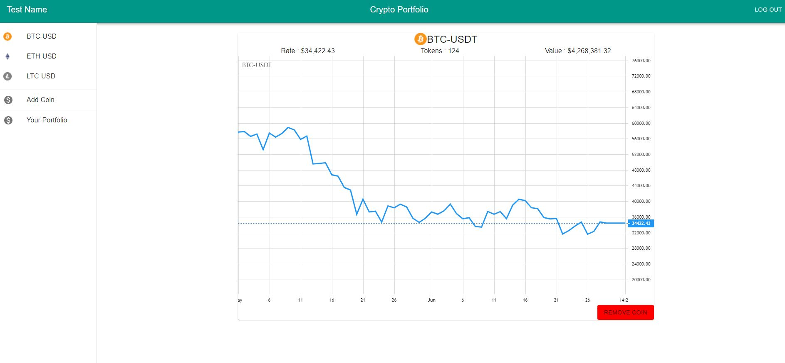
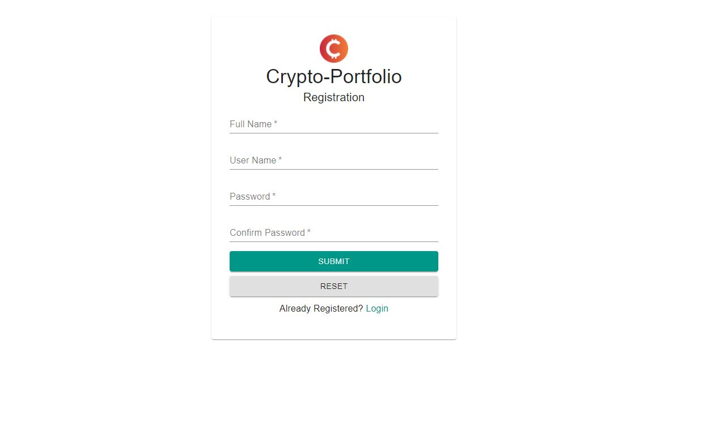

# Crypto-Portfolio
Realtime Portfolio Tracker for Crypto-Currency

## Features
- User can add number of Crypto-Currency Tokens owned and Track their value in Real-Time.
- Display Realtime Grpah of the desired Crpto-Currency.
- Sign up and Sign In functionality so users can store their portfolio online.

## Tech Stack
### Frontend
ReactJs, Material-UI, Redux-Saga, Javascript.

###Backend
Spring, Spring Boot, Spring Data JPA, MongoDB, Map Struct.

##Screenshots

###LoginPage

###Registration

###Dashboard

